theme: Letters from Sweden, 0

# [fit] **Applied Machine Learning**

 
*Amit Kapoor*
@amitkaps
 
*Bargava Subramanian*
@bargava

---

> What I cannot create, I do not understand 
-- Richard Feynman

---

# Approach
- Understand the ML Process.
- Code it to learn it.
- Play with code.

---

# Agenda

### Module 1: Linear Models
### Module 2: Model Evaluation 
### Module 3: Tree-based Models
### Module 4: Unsupervised Learning

---

# Schedule
1000 - 1130: Session 1
1120 - 1130: Break
1130 - 1230: Session 2
1230 - 1330: Lunch
1330 - 1530: Session 3
1530 - 1540: Break
1540 - 1700: Session 4

---

> It’s tough to make predictions, especially about the future.
-- Yogi Berra

---

## What is Machine Learning (ML)?

> [Machine learning is the] field of study that gives computers the ability to learn without being explicitly programmed.
-- *Arthur Samuel*

 

> Machine learning is the study of computer algorithm that improve automatically through experience
-- *Tom Mitchell*

---

# ML Problems
- “Is this cancer?”
- “What is the market value of this house?”
- “Which of these people are friends?”
- “Will this person like this movie?”
- “Who is this?”
- “What did you say?”
- “How do you fly this thing?”. 

---

# ML in use Everyday
- Search
- Photo Tagging
- Spam Filtering
- Recommendation
- ...

---

# Broad ML Application
- Database Mining e.g. Clickstream data, Business data
- Automating e.g. Handwriting, Natural Language Processing, Computer Vision
- Self Customising Program e.g. Recommendations

---

# ML Thought Process

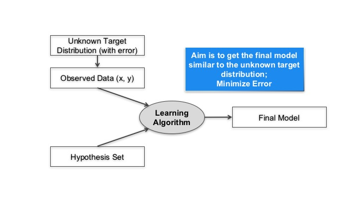

---

# Learning Paradigm
- *Supervised* Learning
- *Unsupervised* Learning
- *Reinforcement* Learning
- *Online* Learning

---

# Supervised Learning
- Regression
- Classification

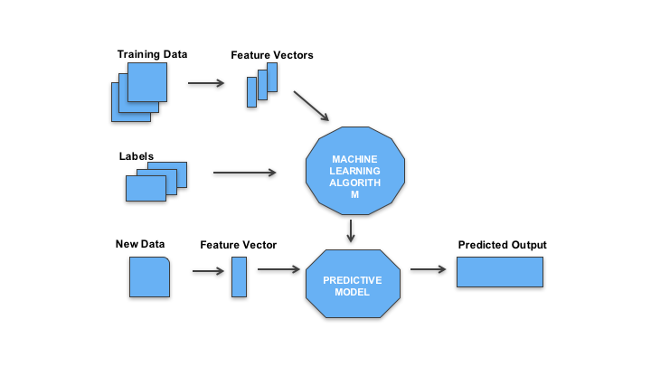

---

# Unsupervised Learning
- Clustering
- Dimensionality Reduction

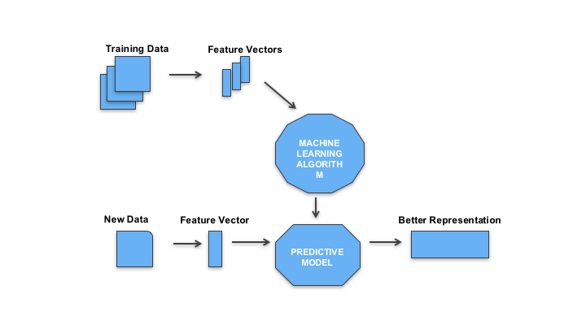

---

# ML Pipeline

- *Frame*: Problem definition
- *Acquire*: Data ingestion 
- *Refine*: Data wrangline
- *Transform*: Feature creation 
- *Explore*: Feature selection 
- *Model*: Model creation & assessment
- *Insight*: Communication 

---

# Linear Regression

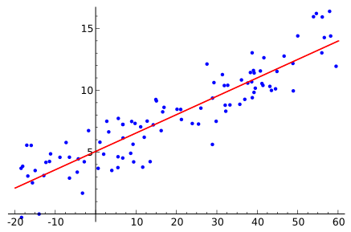

---

## Linear Relationship

$$ y_i = \alpha + \beta_1 x_1 + \beta_2 x_2 + .. $$

## Objective Function

$$ \epsilon = \sum_{k=1}^n (y_i - \hat{y_i} ) ^ 2 $$

  
*Interactive Example: [http://setosa.io/ev/](http://setosa.io/ev/ordinary-least-squares-regression/)*

---

# Logit Function

### $$ \sigma (t)={\frac {e^{t}}{e^{t}+1}}={\frac {1}{1+e^{-t}}}$$

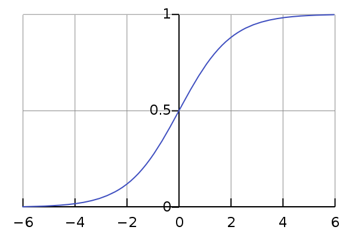

---

# Logistic Regression

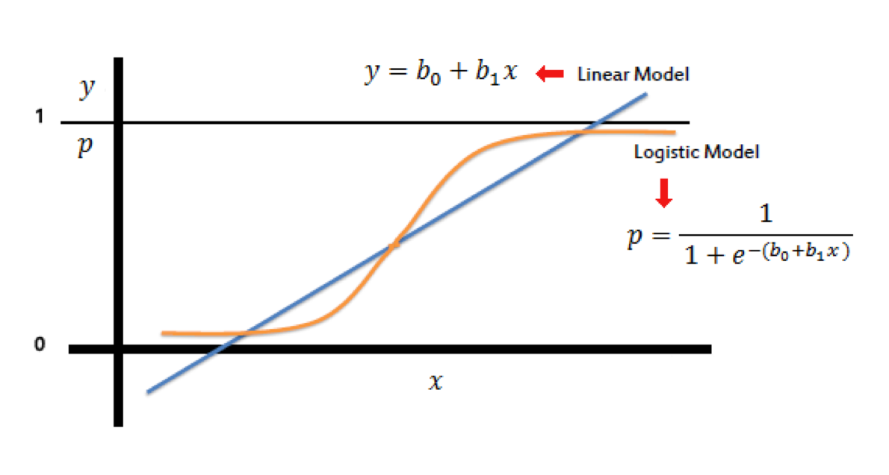

---

# Logistic Relationship

Find the $$ \beta $$  parameters that best fit:
$$ y=1 $$  if $$\beta _{0}+\beta _{1}x+\epsilon > 0$$
$$ y=0$$, otherwise

Follows:

$$ P(x)={\frac {1}{1+e^{-(\beta _{0}+\beta _{1}x)}}} $$

---

# Fitting a Model

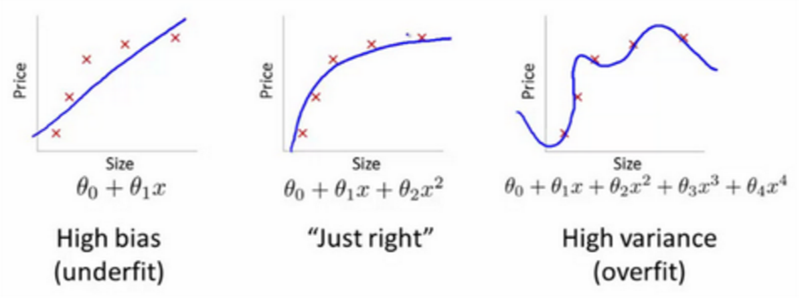

---

# Bias-Variance Tradeoff

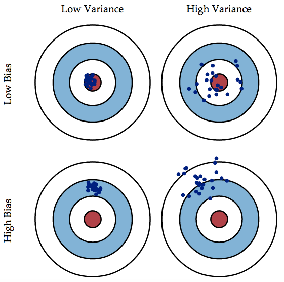

---
# Train and Test Datasets

Split the Data - 80% / 20%

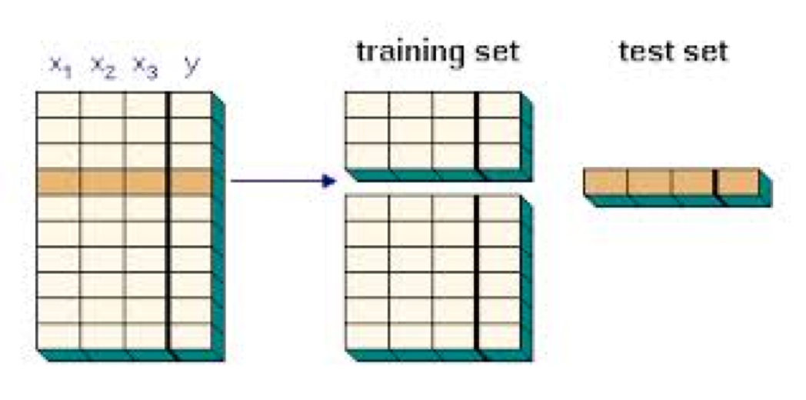

---

# Train and Test Datasets

Measure the error on Test data

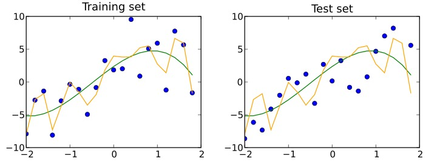

---

# Model Complexity
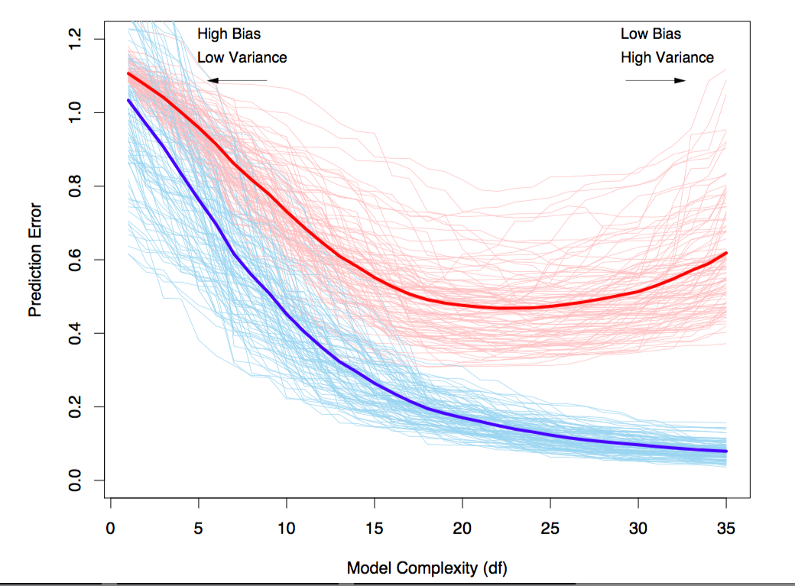

---

# Cross Validation
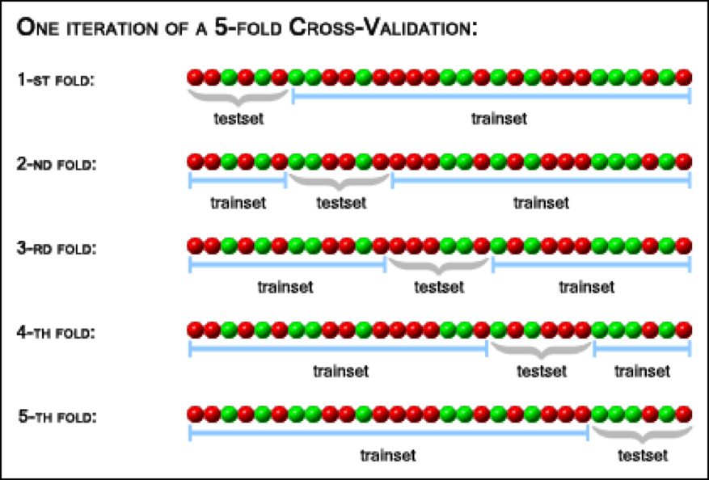

---

# Regularization

Attempts to impose Occam's razor on the solution

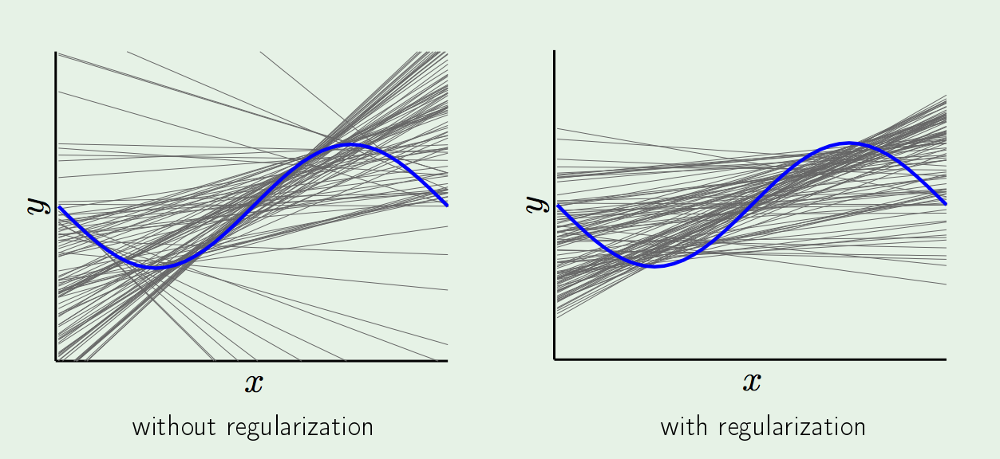

---

# Model Evaluation

Mean Squared Error

$$ MSE = 1/n \sum_{k=1}^n (y_i - \hat{y_i} ) ^ 2 $$

---

# Model Evaluation 

Confusion Matrix

---

# Model Evaluation 

**Classification Metrics**

Recall (TPR) = TP / (TP + FN)
 
Precision = TP / (TP + FP)
 
Specificity (TNR) =  TN / (TN + FP)

---
# Model Evaluation

**Receiver Operating Characteristic Curve** 

Plot of TPR vs FPR at different discrimination threshold
 
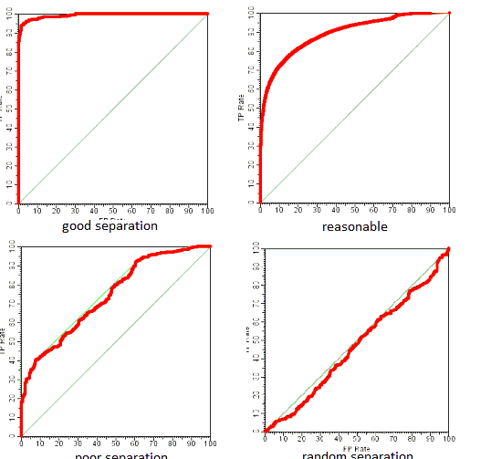

---

# Decision Tree

Example: Survivor on Titanic

---

# Decision Tree

- Easy to interpret
- Little data preparation
- Scales well with data
- White-box model
- Instability – changing variables, altering sequence
- Overfitting

---

# Bagging
- Also called bootstrap aggregation, reduces variance
- Uses decision trees and uses a model averaging approach

---

# Random Forest
- Combines bagging idea and random selection of features.
- Similar to decision trees are constructed – but at each split, a random subset of features is used. 

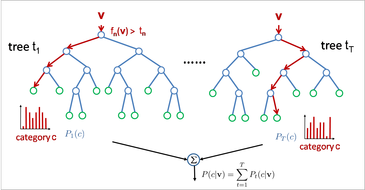

---

> If you torture the data enough, it will confess.
-- Ronald Case

---

# Challenges
- Data Snooping
- Selection Bias
- Survivor Bias 
- Omitted Variable Bias
- Black-box model Vs White-Box model
- Adherence to regulations

---

# Reflections
- Steep learning curve
- Different level
- Balance speed and coverage
- Be considerate
